<h1 align="center"> Yi-Framework</h1>
<h4 align="center">A .NET 8 Web open-source Asp.NetCore framework focused on user experience.</h4>
<h5 align="center">Supports Native/Abp.vNext/Furion/Ruoyi/Pure</h5>
<h2 align="center">A comprehensive solution that ultimately becomes a wheel</h2>

English | [简体中文](README.md)
****
## 🍍  Introduction:
YiFramework is a DDD (Domain-Driven Design) backend open-source framework based on .Net8, Abp.vNext, and SqlSugar.

Who says ABP is complex? Who says DDD is difficult?`Breaking conventions, simplifying complexity.`,Newcomer-friendly and one of the best approaches for project extensions.

Modular design allows for the independent inclusion or exclusion of components based on business needs. It is an all-encompassing framework where you may gain unique insights.

A Comprehensive Solution, Ultimately Just Another Wheel.

(Frequent updates, feel free to watch for continuous updates.)

— This is not just a program; it is also a work of art, focused on artistic development!

> Core Features: Simple and easy to use, the framework is not referenced in a packaged form, but is provided directly with the project alongside the source code. It offers maximum freedom and complies with the MIT license, allowing for unrestricted modifications (please indicate the source).

**Branch Directory：**

- Branch  **Abp**: Based on the Abp.vNext branch, DDD (Domain-Driven Design) simplifies the essence of development, providing support for multiple frontends from one backend.

- Yi.Abp.Net8：Backend
- Yi.Bbs.Vue3：Bbs Community - Frontend
- Yi.Doc.Md: Open Source Documentation Tutorial
- Yi.Pure.Vue3：Pure TS Backend Frontend
- Yi.RuoYi.Vue3：RuoYi JS Backend Frontend

****

##  🍊  Official website and demo link：

Let's get straight to the point and provide the link.

YiCommunity official website URL.(Bbs)：[ccnetcore.com](https://ccnetcore.com)  (Now live, welcome to join!)

Rbac：https://ccnetcore.com:1000  (userName cc\password 123456)

Pure：https://ccnetcore.com:1001  （userNamecc\password 123456）

##  🍏  Support:

- [x] Fully supports monolithic application architecture
- [x] Fully supports distributed application architecture
- [x] Fully supports microservices architecture

****
##  🍇  Explosive Detail Yi Framework Tutorial Navigation:

1. [Framework Quick Start Guide](https://ccnetcore.com/article/aaa00329-7f35-d3fe-d258-3a0f8380b742)(Completed)
2. [Framework Functionality Module Tutorials](https://ccnetcore.com/article/8c464ab3-8ba5-2761-a4b0-3a0f83a9f312)(Completed)
3. [Practical Development Exercises](https://ccnetcore.com/article/e89c9593-f337-ada7-d108-3a0f83ae48e6)(Completed)
4. [Chengzi Ops CI/CD Tutorial](https://ccnetcore.com/article/6b80ed42-50cd-db15-c073-3a0fa8f7fd77)(Completed)
5. [Version Update Log](https://ccnetcore.com/article/e9e69a38-ce1e-06f5-7944-3a0fdc942ef3)(Completed)

****
##  🍓  Its philosophy:
Who says ABP is complicated? Who says DDD is difficult? Break the norm, simplify complexity, and serve as one of the best ways for newcomers and project second development.

> For every hundred people, there are a hundred different interpretations of DDD. The YiFramework may not strict adherence to DDD principles, but it is built on the shoulders of giants, distilled from numerous projects to craft a best practice.

Effortlessly achieve rapid development; typically, simplicity and elegance are hard to reconcile. The YiFramework does not solely pursue extreme decoupling but considers user experience and ease of use.

A user-oriented rapid development backend framework.

> Once you truly get hands-on, you'll understand this: extreme simplicity is also a form of elegance.
****

##  🍍  Features
- A user-oriented backend framework that is easy to use, suitable for small, medium, and enterprise-level projects.
- The project comes with the source code directly embedded, without packaging, making it ideal for secondary development and modification.
- Includes a large number of reusable modules for common scenarios.
- Elegantly supports distributed and microservices architectures.
- And more…

##  🥭  Core Technologies
#### Backend
C# Asp.NetCore 8.0
- [x] Dynamic API: Abp.vNext
- [x] Authentication and Authorization: Jwt
- [x] Logging: Serilog
- [x] Modularization: Abp.vNext
- [x] Dependency Injection: Autofac
- [x] Object Mapping: Mapster
- [x] ORM: SqlsugarCore
- [x] Multi-tenancy: Abp.vNext
- [x] Background Tasks: Quartz.Net
- [x] Local Caching: Abp.vNext
- [x] Distributed Caching: Abp.vNext
- [x] Event Bus: Abp.vNext

#### Frontend
js Vue3
- [x] Asynchronous Requests: axios
- [x] Charts: echarts
- [x] UI: element-plus
- [x] State Management: pinia
- [x] Routing: vue-router
- [x] Bundling: vite

#### DevOps
- [x] Deployment: nginx
- [x] CICD: gitlab+Jenkins
- [x] Docker: harbor

####  🍉 Demo： 
 <table>
    <tr>
        <td>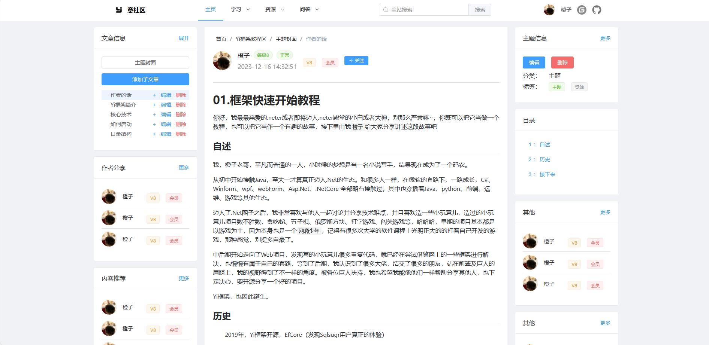</td>
        <td>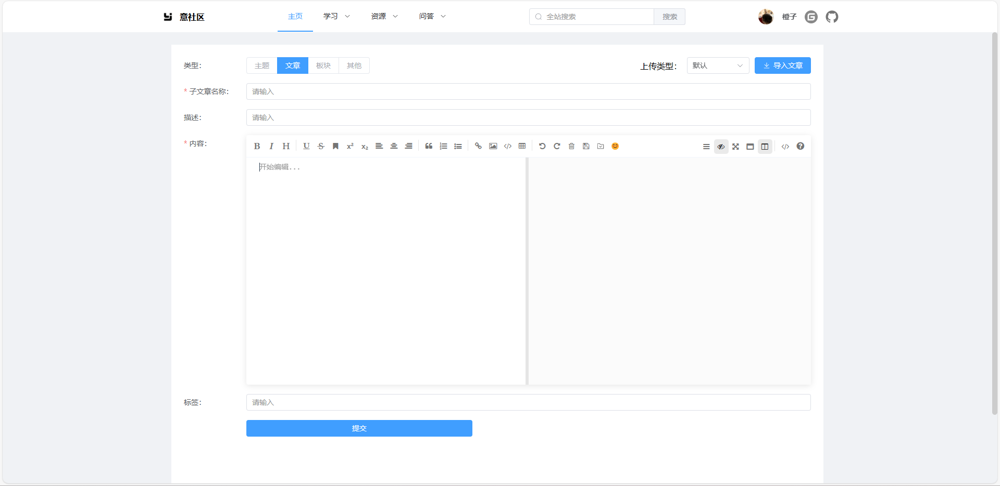</td>
    </tr>
    <tr>
        <td>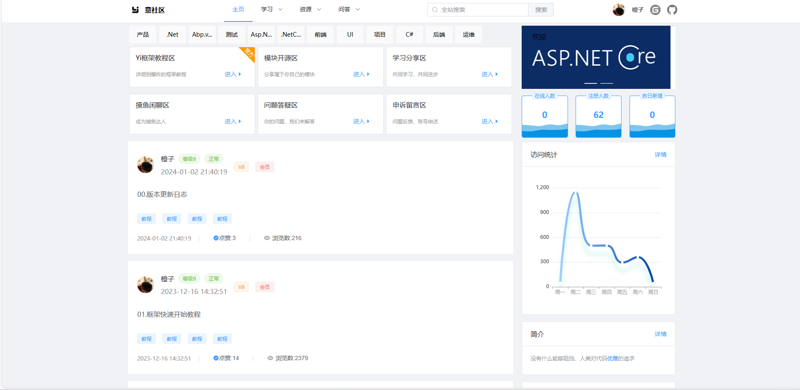</td>
        <td>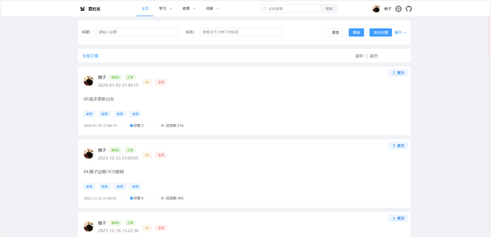</td>
    </tr>
</table>

 <table>
    <tr>
        <td>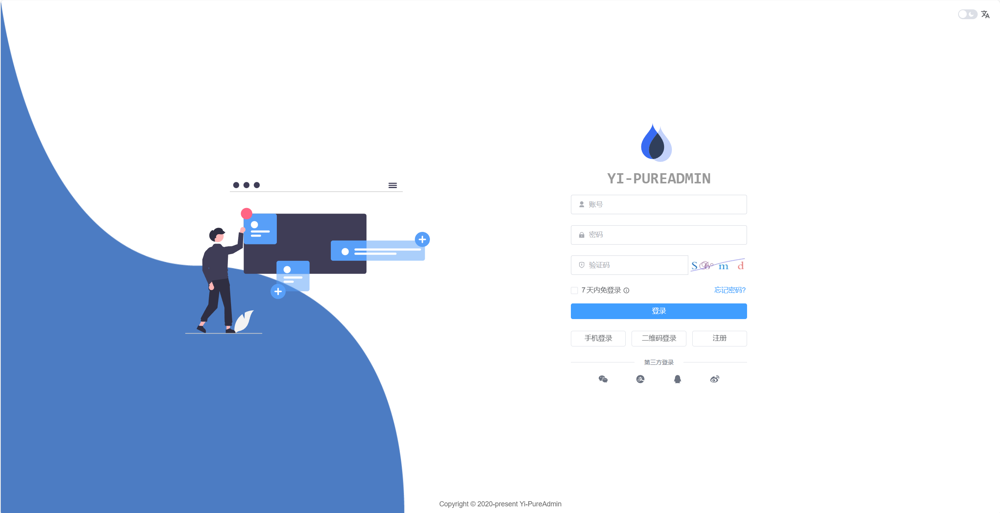</td>
        <td>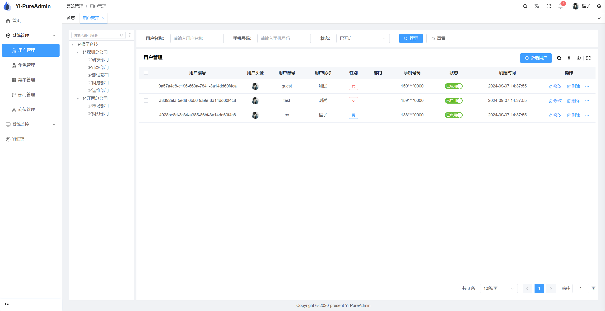</td>
    </tr>
    <tr>
        <td>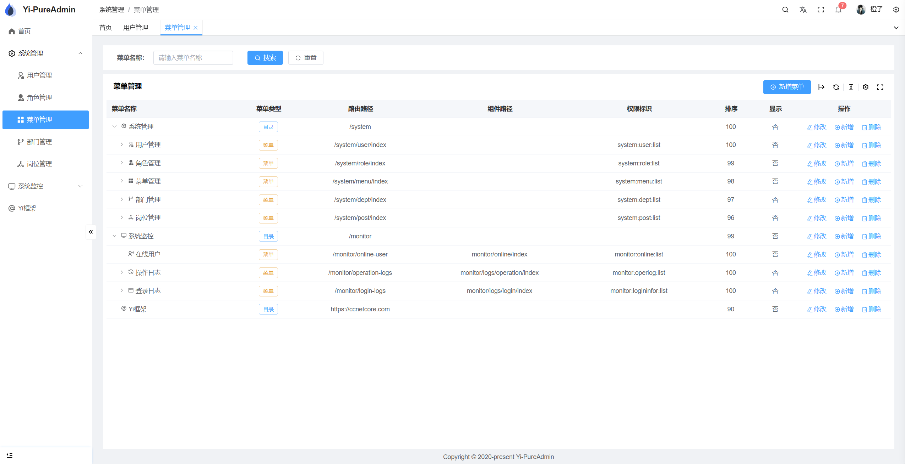</td>
        <td>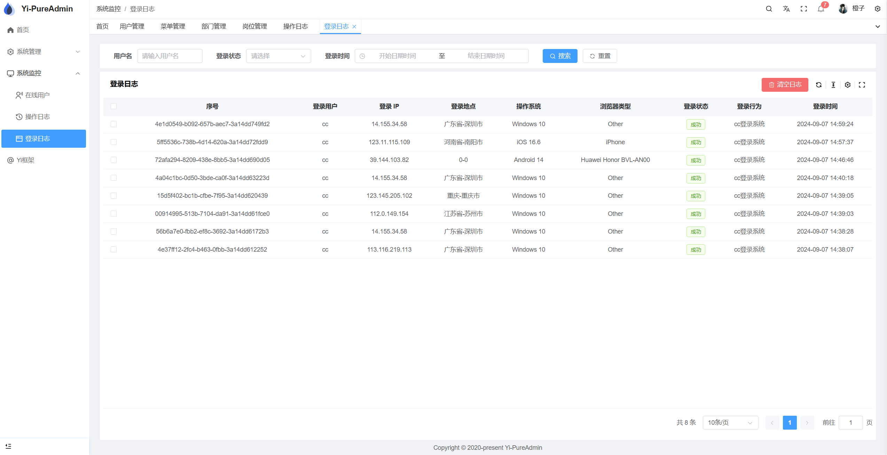</td>
    </tr>
        <tr>
        <td>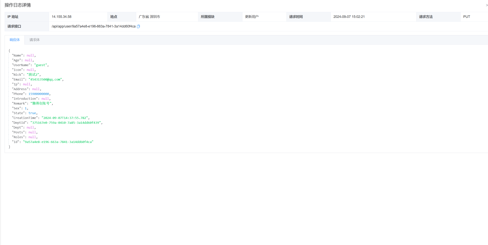</td>
        <td>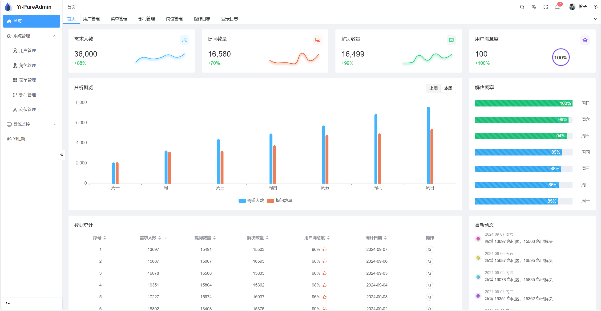</td>
    </tr>
</table> 

 
<table>
    <tr>
        <td>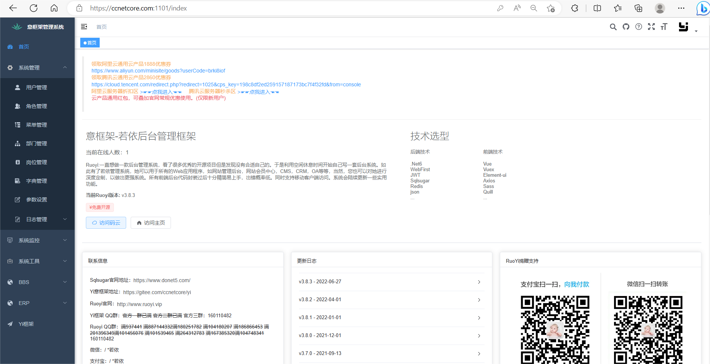</td>
        <td>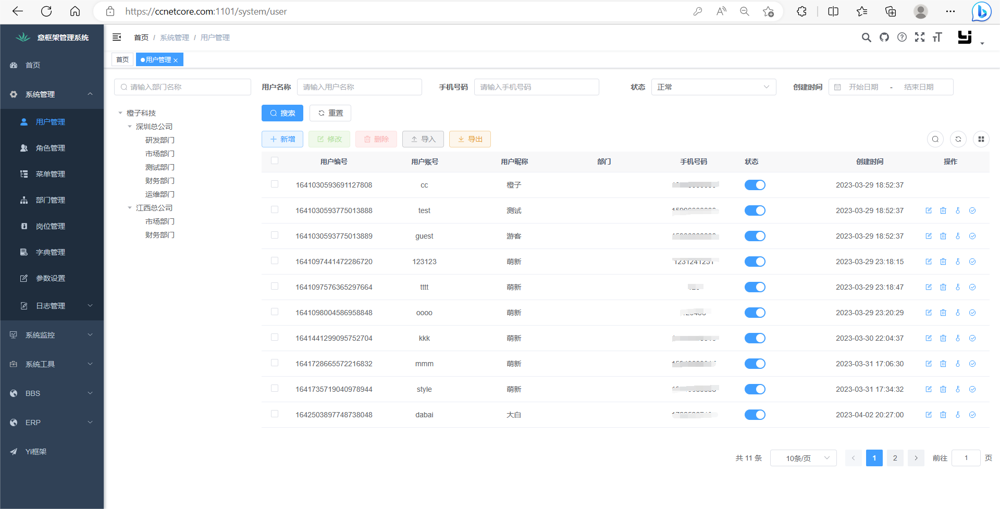</td>
    </tr>
    <tr>
        <td>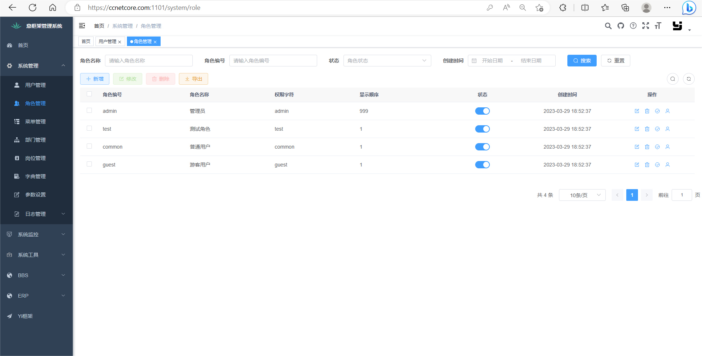</td>
        <td>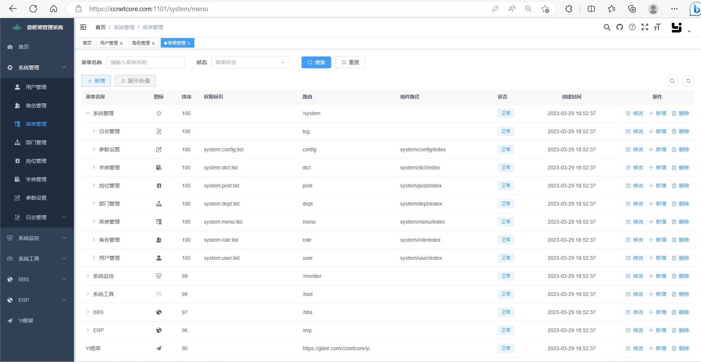</td>
    </tr>
    <tr>
        <td></td>
        <td></td>
    </tr>
    <tr>
        <td>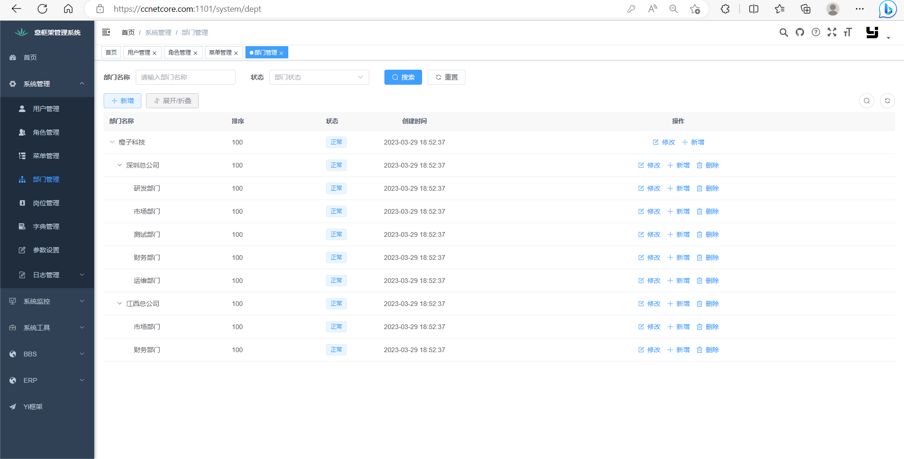</td>
        <td>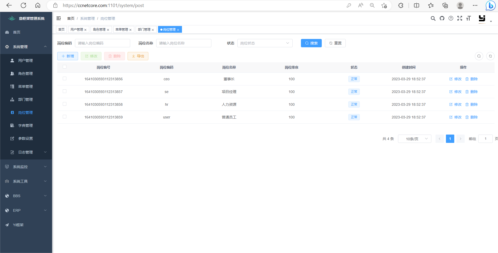</td>
    </tr>
    <tr>
        <td></td>
        <td>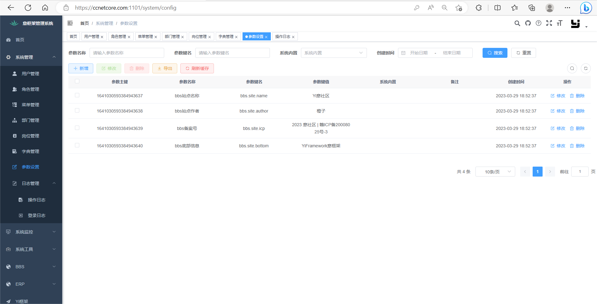</td>
    </tr>
    <tr>
        <td></td>
        <td>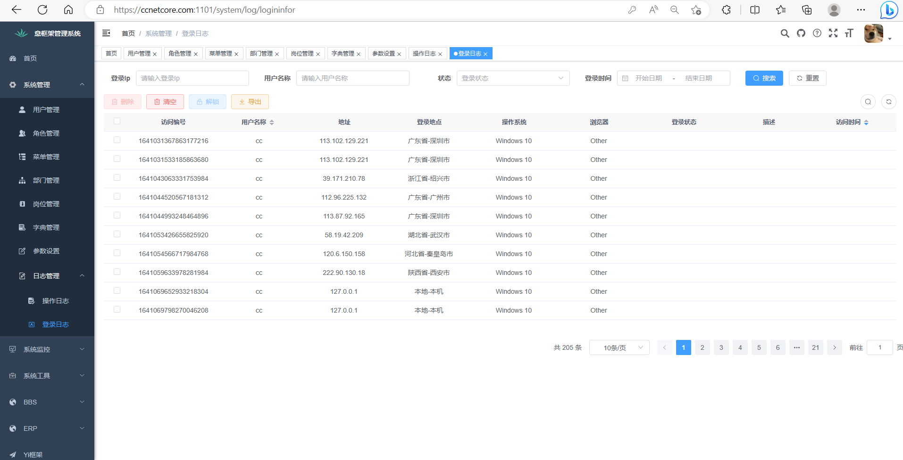</td>
    </tr>
    <tr>
        <td>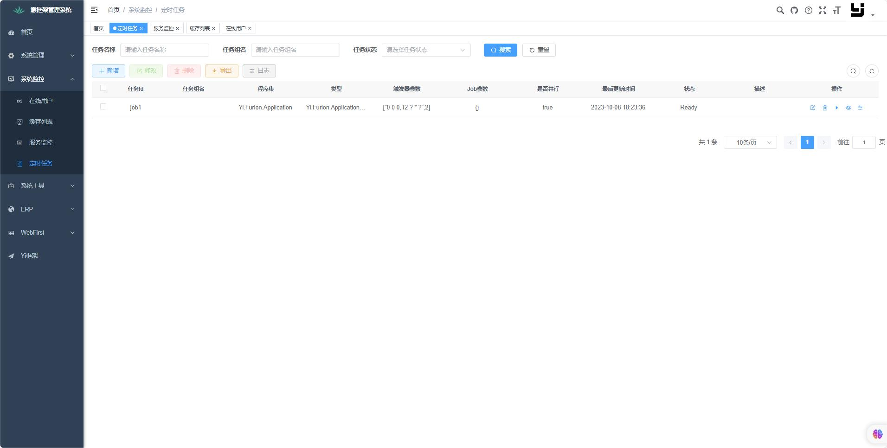</td>
        <td>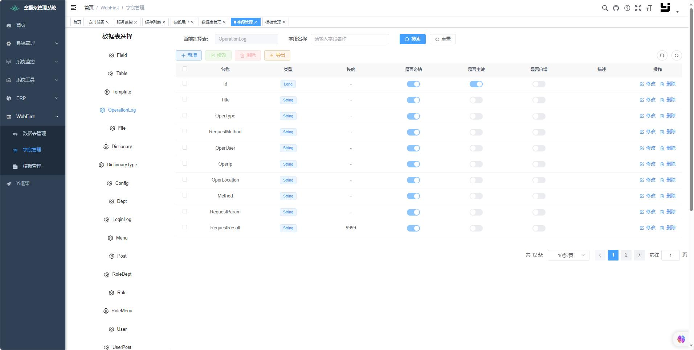</td>
    </tr>
</table>

##  🌶  Thank you：

[橙子]https://ccnetcore.com

[XWen]https://gitee.com/on-wensil

[朝夕教育]https://www.zhaoxiedu.net

[Sqlsugar老杰哥]https://www.donet5.com/Home/Doc

[车神]微信公众号搜索Dotnet技术进阶

[RuYiAdmin如意老兄]https://gitee.com/pang-mingjun/RuYiAdmin

[ZrAdminNetCore字母老哥]https://gitee.com/izory/ZrAdminNetCore

[Admin.NET]https://gitee.com/zuohuaijun/Admin.NET

[Furion百小僧]https://furion.baiqian.ltd/

****
##  🌽 Contact Us:

Author's QQ：`454313500`

QQ group chat：官方一群（Full）、官方二群（Full）、官方三群：`786308927`（Full）、官方四群:`498310311`（Full）、官方五群:`981136525`（New）

WeChat Group Chat：官方微信一群（Full）、官方微信二群

WeChat Community: Add the author's WeChat chengzilaoge520 （橙子老哥520）,Note: Join the group.

Contact the author, everyone here is a consultant.

Official website message area：[ccnetcore.com](https://ccnetcore.com) 

****
##  🍄 FQA:

Visit the official website to view the message board.

[the message board](https://ccnetcore.com/discuss/1641030787056930818)