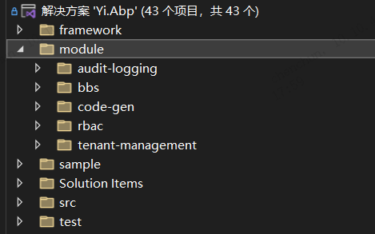
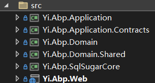

## 模块与项目
意框架是一个基于Abp.VNext的框架，完美使用模块化理念进行开发。既然是模块化开发，就有`项目`与`项目`的概念。

很多人问到了我，我的代码应该放到哪里，其实是没有分清楚模块与项目，弄清楚这个，再下手撸码，才更有方向。

其实不必一堆概念，只需要心中思考一下

> 我接下来要开发的业务是否有必要被其他项目依赖使用？

例如：内置的Rbac模块、Bbs模块，单独具备权限管理和社区论坛的功能，公开给大家复用引用，这就可以当成一个模块

`但是`，有时候如果我不认为他有必要复用，就是公司的一个内部系统，想要快速开发并交付，要同时具备权限管理、商城、审批等各种功能，那就直接当一个项目开发即可，不一定需要将各个模块拆的太散

> 这个划分的界限，是由项目来决定

注意：模块的代码与项目的代码结构几乎没有区别

这意味，有一个最好的方式，先将业务全部写在项目中，等稳定之后，在复制抽象到模块中，完全没有问题。

### 模块的优缺点
- 优点：高度抽象复用
- 缺点：肉眼可见的程序集增加、维护成本更高

### 模块

代码位置放在`module`目录下，单独建立一个自己的模块名称,可使用`脚手架使用`将默认代码生成在这里。

### 项目

框架内置一个host项目，代码位置存放在`src`中，直接使用即可，如果想更换命名，可以使用上一节的`脚手架使用`。

## 总结
> 由于很多人询问我这个问题，所以单独写一篇，方便大家理解。

先区分模块还是项目，然后代码写到对应的位置即可

理论上，按这套规则意味着，只有在自己的`module`、`src`下才需要写代码，其他地方都是内置好了的，通过继承、实现等方式扩展即可

当然，你可以不按这套规则出发，目录结构按自己的舒服的方式去设计，当然也是可以的，不过这得花费一些时间了。
