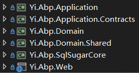
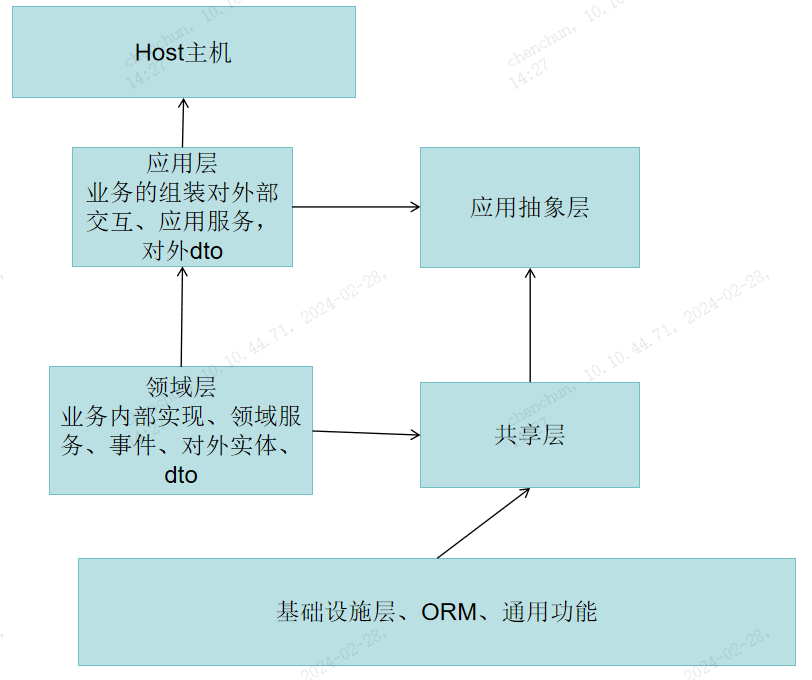

大家好呀~ 最近我这里收到很多人的疑惑
 - 从零开始我怎么手动分层依赖搭建一个项目
 - 如果想依赖其他组件应该怎么引入
 - 为什么要这样分层？和三层架构有什么区别？
 - 等等

这些问题，很多初学者会疑惑的地方，就是照葫芦画苗，但是也说不出理由来，最后反而失去了这样分层的优势。

每一层都是有它的理由，明确了意义，在编码阶段才更得心应手，发挥出这样分层的作用。

> 题外话，很是有缘，在完全没有接触过DDD的分层的时候，还是停留在三层架构的时期，对于大型复杂的依赖关系，Service满天飞，根本难以下手，写出的代码交错复杂，稍微隔一段时间没去回顾，再去看，就会被自己的代码给绕死，所以我就一直想换一种分层模式，想让各个服务结构更加清晰，不再是直肠子式的三层架构，那我做的第一件事情，就是把关系比较紧密的给装在一起当成一个整体，各个整体之间不轻易去依赖，而是通过事件去抛出去。这就在早期形成了一套依赖关系比较清晰的框架，经过不断的项目历练，慢慢的就变成了业务聚合、应用组装等等概念，等到机会接触到了DDD分层一看，`哇塞，怎么那么像？这怕不是他抄我的分层嘛`，当然开个玩笑，从此对这块的了解更加加深，确实值得很多大家应该学习的地方，提升一下自己。

> 一千个码农，就有一千个DDD。DDD不一定完全是对的，但一定是值得学习使用的

> 在此，老橙子很乐意以我的血淋淋的教训的角度给大家讲清楚，框架的分层依赖关系，同时也是标准的`DDD分层架构`依赖关系，希望能给大家带来一些帮助~

## 依赖关系
这个标题其实已经在之前一个章节有涉及到一部分,`目录结构`，不过既然想弄清楚依赖关系，就得先了解目录结构，大家可以先回顾一下，弄清楚有哪些文件，再看它的依赖关系

从上至下，分别是

 - 应用层
 - 应用抽象层
 - 领域层
 - 领域共享层
 - 基础设施ORM层
 - Host主机 

对应的项目引用关系下图所示：

可以从上图很直观的看出：

最顶层的`host主机与下面的应用`没有关系，意味着host主机可以是web、可以是cs、可以等等，所以我们的host主机只充当一个web启动的作用，不包含业务逻辑

另外，发现目录中只包含ORM，好像没有基础设施层，其实是一个包含关系，是ORM属于基础设施中的一种，但是为了将orm抽象，特意把ORM独立了一层

由于框架的基础设施都已经在Framework里面包含，所以没有单独建立一层新的基础设施层，你完全可以`再加一层`在ORM下当作基础设施即可。

> web应用中，对数据库操作涉及非常广，所以ABP将ORM特意抽象出来，可实现EFCore、MongoDb等数据库无缝切换。

## 每层的内容
- **基础设施层**，存放各种通用方法、ORM等
- **领域共享层**，存放枚举、常量、事件参数、对应用层的dto
- **领域层**，存放业务的内部实现（领域服务）、领域事件。对外也就是对应用层可以暴露实体、对应用层的dto
- **应用抽象层**，存放应用层抽象、系统对外的dto
- **应用层**，存放对业务的组装（领域服务），对外暴露的dto，主要是对外的用户交互相关的业务
- **Host主机**，存放跟WebHost，类似web启动器，包括中间件、swagger、等与web相关

## 为什么要这样分层？
弄清楚了分层结构，已经依赖关系，我们可以探究里面的原理，我们为什么要这样做？这样做的道理或者好处是什么？

### 基础设施层
首先，不管是任何系统，想要对通用方法的复用，就必然有基础设施供整个系统的使用。这个`基础设施层`其实就类似于三层架构的`Common层`，这个没啥说的

这一层目的是为了通用方法的复用

### 领域层
领域，这个词经常出现，感觉很抽象，我们可以把他类比成`盒子`或者`模块`，比如电商系统的售前、售后，我们这可以分成两个大的`领域`。
这里是整个结构的业务实现在这块，也是最重的一层。严格来说，不同领域之间想要调用，比如售后领域想查看售前领域的记录，可以通过事件抛出来，从而各个领域之间没有强耦合。

这一层的作用是实现各个领域的业务

### 领域共享层
这里只是存放一些领域所要使用的枚举、常量等，除了基础设施不要有其他的依赖，轻、也轻越好，因为他的目的不是对内，而是提供给给外部系统使用的。

这一层的作用是存放共享的枚举、常量等，也是为了存放领域层暴露给应用层的dto（比如领域层想暴露一个用户角色菜单对象，实体无法满足，就需可以创建这样的一个dto了，在其他文章可能大家会叫做info对象）

### 应用层
领域层是对内的，外部系统是不清楚的，那我们的业务实现想暴露出去，要通过应用层进行包装，因为应用层是对外的，对用户交互相关处理，比如api、signalr等

这一层的目的是对领域层的组装及数据的效验、对外用户交互相关处理。

### 应用抽象层
这里主要目的是将应用层暴露进行抽象，该层是为了提供外部系统之间依赖，于`领域共享层`类似，所以这一层也非常的轻，从上面的依赖关系图来看，`领域共享层`于`应用抽象层`是一条线性依赖。

这一层目的是为了`应用抽象层`可以被外部系统之间引用，从而通过Http代理等技术，实现远程调用接口访问`应用层`进行交互。这里感兴趣的可以看一下Abp.VNext的HttpProxy模块，默认意框架中不引入，等有需要的时候可以使用。

## 小结
以上分层，是DDD推荐的一种最佳实践方式之一，很荣幸，通过我十几个上线项目应用情况，事实证明，非常nice

补充一句话，我不是DDD的崇拜者，只是在被各种业务折磨的不行的码农想追求一种方法，让花更少的时间更好的去完成任务。

所以，我的内容是比较偏向实践，正如意框架一般，一个追求以用户体验为中心的框架。

意框架很多地方并没有完全严格走DDD，包括Abp等有名的框架，过于严格，代码体验感反而是下降。有很多场景其实是没有必要的，过长的代码、过绕的领域关系，写个增删改查还得花很多时间，这也是为什么DDD难以被接受的原因之一。