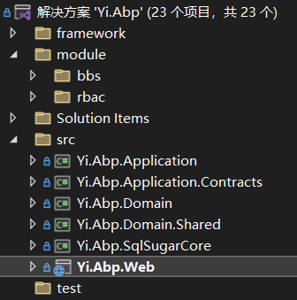
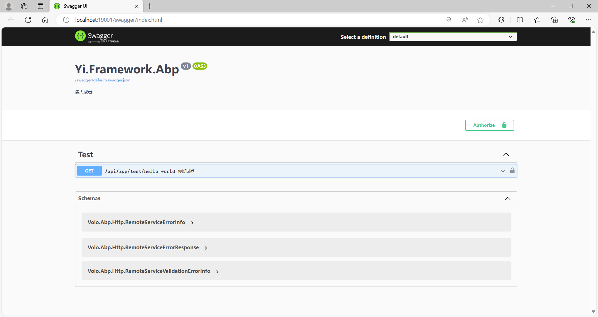
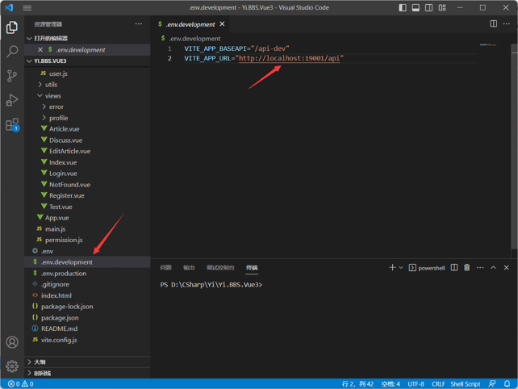
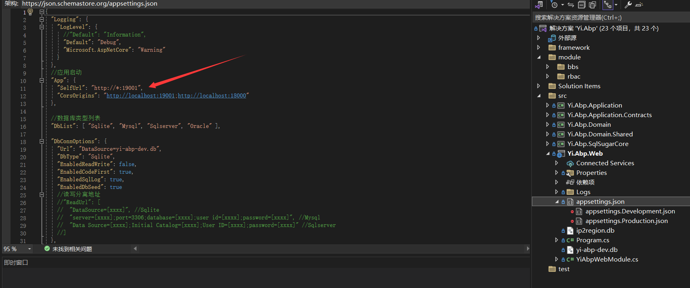

本项目为前后端分离项目，后端需要.Net8环境启动，前端需Node.js环境启动

推荐下载开发工具：

- Visual Studio 2022
- Visual Studio Core

## 后端
vs选中启动项目Yi.Abp.Web模板项目  

直接启动即可，无任何其他环境依赖，数据库默认采用`Sqlsite`，缓存默认采用`本地缓存`

启动后，浏览器将会弹出项目接口地址swagger：

> 纳尼？怎么就看到一个测试接口？莫急，由于模块化方式，接口会越来越多，已自动分组至右上角，请点击分组

恭喜你，已经成功运行后端，是不是很简单？

> 等等？表结构呢？表数据呢？为什么没有sql文件？在这里，统统不需要，配置文件默认开启CodeFirst可自动建库及表结构，默认开启DataSeed种子数据，自动创建初始化数据

默认种子数据超级管理员账号：cc  /  123456

## 前端
对于前端，默认提供两个项目，分别对应后端的BBS与RBAC

- BBS -> Yi.BBS.Vue3
- RBAC -> Yi.RuoYi.Vue3

可根据需要选择进行启动

1:还原依赖

> npm install

2:启动项目

> npm run dev

## 配置启动地址：
前端：

后端：
