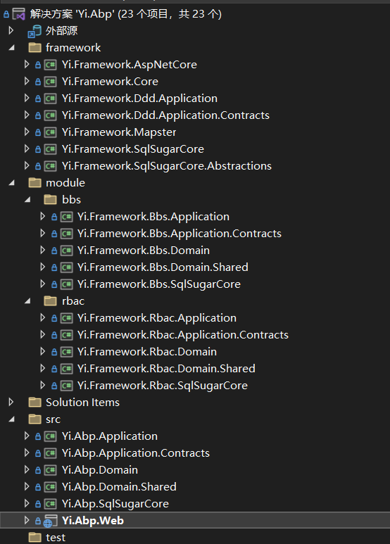
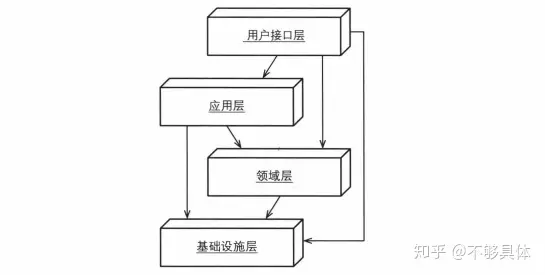
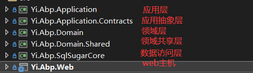
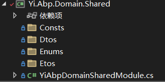
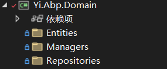
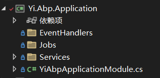
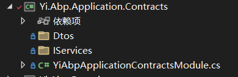
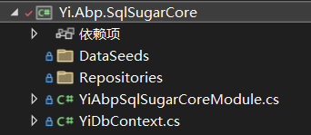
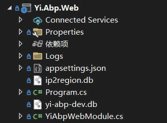

好了，相信当你非常容易的启动了项目之后，并看到了页面效果，也感受到它的简易

废话少说，直接上图：

***感觉和传统的不太一样，怎么这么多类库，感觉很难上手***

NONONONONO!

恰恰相反，其实对于使用用户来说我们只关注src中的Yi.Abp即可，如下图：
项目模板结构：

> 懂Abp.vNext的大佬看到目录就会有一股熟悉的味道

Yi框架并没有直接采用Abp.vNext的模板生成，而是从零进行搭建起来的，但其中的分层结构与Abp.vNext是一致的，只是EntityFramework更换成了SqlSugar

总体来看分为以下3个部分：
- Framework （Yi.Framework框架部分,基础设施）
- Module（Yi.Framework提供的内置模块部分，例如Rbac、Bbs）
- Src （真正业务进行开发的部分）

很好，换句话来说，只需要关注Src部分，其他的都以`源代码`的方式，并没有进行打成nuget包，1是为了方便二开，2是为了方便大家学习，3是本来也不复杂

现在，我们来好好见识下为何如此分层吧~

说到分层，不得不提这个经典神图

这张图就对应着我们的结构

这个可能没接触过DDD的不能理解，为什么要这样分层，三层架构不好吗?这样感觉好难，不能理解！且慢，待你看完下面每层的概述，你就不会认为简单，这不比三层架构简单？

首先，Yi框架的分层非常明确，命名属于严格类型，对于初学者，一眼看破

简单分为6个类库
1. 应用层
2. 应用抽象层
3. 领域层
4. 共享层
5. 基础设施Sqlsugar层
6. Web层

我们从下至上讲解：
## Doman.Shared 共享层
最底层是Doman.Shared，共享层，这里存放各个常量、枚举、不依赖各个模块的通用类：

> Doman.Shared，共享层 是一层很简单、不包含业务的模块，让它尽可能简单，有没有感觉像三层架构的Common？

## Domain 领域层
只依赖Doman.Shared的`Domain领域层`

你可以选择存放大部分业务到领域层中，我们称这种模式叫做：`重领域层模式`
你也可以选择存放大部分业务到它的上一层，Application 应用层，叫做：`重应用层模式`

在领域层中，你的实体，以及跟实体相关的设施可在这里
同时你也可以创建领域服务(Managers文件夹中)，管理当前子领域的聚合，例如：

> 在学校模块中，包含了学生、教师、教室，为了更加聚合，可在学校模块中创建领域服务

## Application 应用层
接下来，是应用层

熟悉的Crud、熟悉的Service，这里可以存放简单的通用业务，例如：Crud
如果是重应用层开发，你完全可以将业务写入到应用层，当一个快乐的三层架构Crud，Boy

另外，关于上次的Job任务调度、事件处理也可以放在这里进行处理

> 简单而优雅~何乐而不为?

## Application.Contracrs 抽象层
Application.Contracrs应用抽象模块，是对应用模块的抽象，它的结构也非常的简单

这里有Dtos的概念，不出意外，大部分人已经接触，具体的可以在后续Crud中进行讲解

## SqlSugarCore 数据访问层

这一层中，依赖领域层，但是不依赖应用层
用于使用Sqlsugar相关的操作，比如`自定义仓储`
但是，其实大部分通用场景，框架内部已经封装，能用到这层的机会都比较少
对复杂的数据访问封装

> 由于Querable对象用起来并没有到达SugarQuerable的爽感，且也不想让每个复杂查询都通过仓储进行扩展，这会导致用户使用感较差，所以经过各类平衡考虑，YiFramework框架与Sqlsugar是有轻量的`耦合性`的，框架提供Sqlsugar抽象层，避免过重的耦合，意味着，你可以在大部分地方使用Sqlsugar的操作，这在真正的业务项目来说，使用非常的方便，与Sqlsugar保持有一致的观念

## Web 层
最后一个同样非常简单的一层
Web模块，它的目的只是利用Asp.NetCore host Web主机，将应用层的业务通过Webapi形式暴露出去而已

可以看的出，结构很简单，甚至除了启动配置目录，连其他一个额外的目录都没有

> 综上所述，我们的业务，我的开发代码，大部分都在`领域层`与`应用层`

光说不练，源代码直接提供rbac、bbs两大模块，结构是一致的，直接看看依葫芦画瓢不就清楚啦~