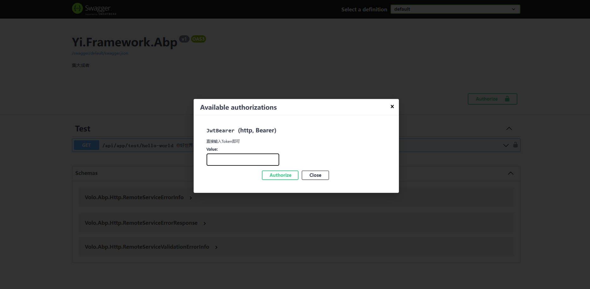

## 简介
> 鉴权是用于解析用户的令牌，知道用户是否携带令牌，并且知道用户信息是谁

改鉴权使用的是微软Asp.NetCore扩鉴权扩展方式
程序模块已内置 
``` cs
context.Services.AddAuthentication(JwtBearerDefaults.AuthenticationScheme)
    .AddJwtBearer(options =>
    {
        options.TokenValidationParameters = new TokenValidationParameters
        {
            ClockSkew = TimeSpan.Zero,
            ValidateIssuer = true,
            ValidateAudience = true,
            ValidateLifetime = true,
            ValidateIssuerSigningKey = true,
            ValidIssuer = jwtOptions.Issuer,
            ValidAudience = jwtOptions.Audience,
            RequireExpirationTime = true,
            IssuerSigningKey = new SymmetricSecurityKey(Encoding.UTF8.GetBytes(jwtOptions.SecurityKey))
        };
        options.Events = new JwtBearerEvents
        {
            OnMessageReceived = context =>
            {
                var accessToken = context.Request.Query["access_token"];
                if (!string.IsNullOrEmpty(accessToken))
                {
                    context.Token = accessToken;
                }
                return Task.CompletedTask;
            }
        };
    });
```
## 如何使用
默认已经集成，所以在使用方面，可要求客户端添加标准的jwtbear头即可

swagger 接口文档中，已集成，直接输入jwttoken即可


我们采用的是HSA对称加密方式，只需要具备密钥
对应的配置文件
``` json
  //鉴权
  "JwtOptions": {
    "Issuer": "https://ccnetcore.com",
    "Audience": "https://ccnetcore.com",
    "SecurityKey": "zqxwcevrbtnymu312412ihe9rfwhe78rh23djoi32hrui3ryf9e8wfh34iuj54y0934uti4h97fgw7hf97wyh8yy69520",
    "ExpiresMinuteTime": 86400
  }
```
## Token如何来
那肯定是登录啊，登录接口会返回Token

那如何制作Token？直接上代码，下面这个也是登录的创建token的方式

``` cs
        /// <summary>
        /// 创建令牌
        /// </summary>
        /// <param name="dic"></param>
        /// <returns></returns>
        private string CreateToken(Dictionary<string, object> dic)
        {
            var key = new SymmetricSecurityKey(Encoding.UTF8.GetBytes(_jwtOptions.SecurityKey));
            var creds = new SigningCredentials(key, SecurityAlgorithms.HmacSha256);
            var claims = dic.Select(x => new Claim(x.Key, x.Value.ToString())).ToList();
            var token = new JwtSecurityToken(
               issuer: _jwtOptions.Issuer,
               audience: _jwtOptions.Audience,
               claims: claims,
               expires: DateTime.Now.AddSeconds(_jwtOptions.ExpiresMinuteTime),
               notBefore: DateTime.Now,
               signingCredentials: creds);
            string returnToken = new JwtSecurityTokenHandler().WriteToken(token);

            return returnToken;
        }
```
