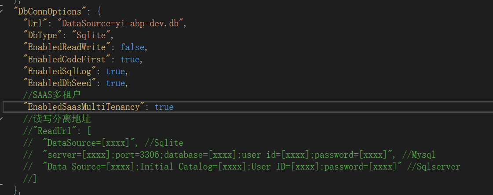
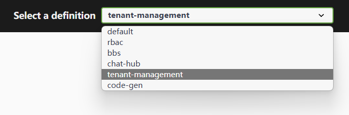
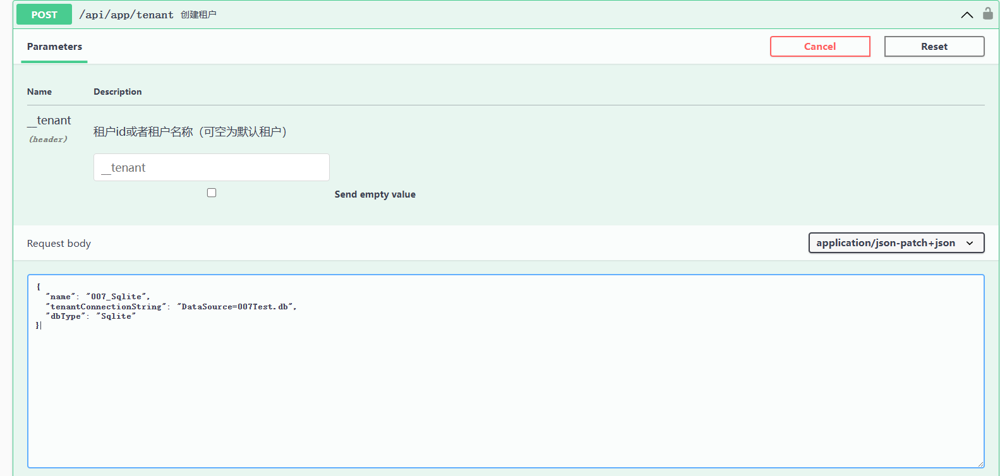
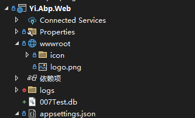
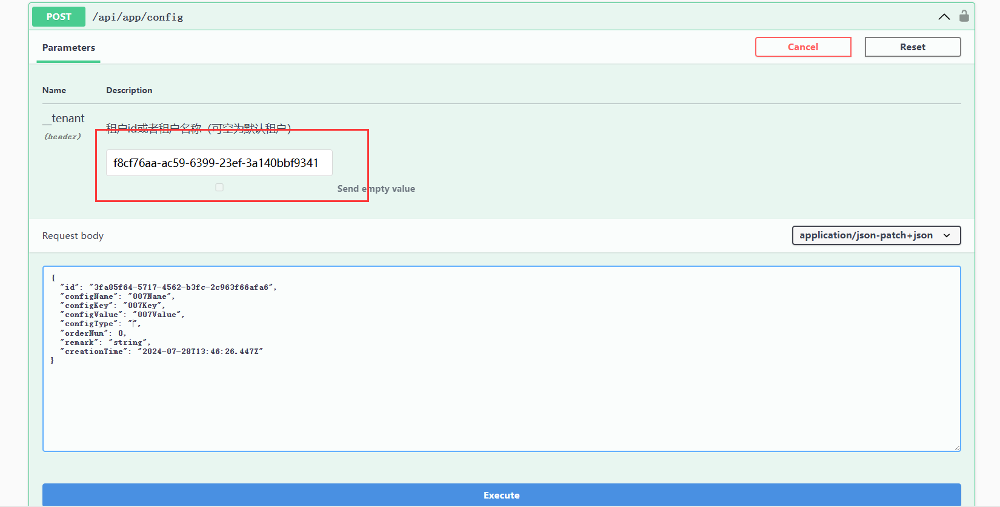
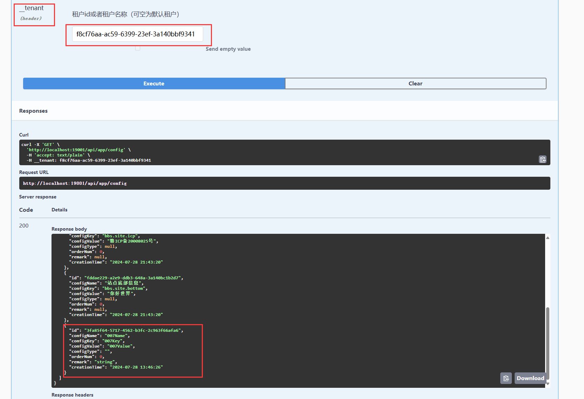
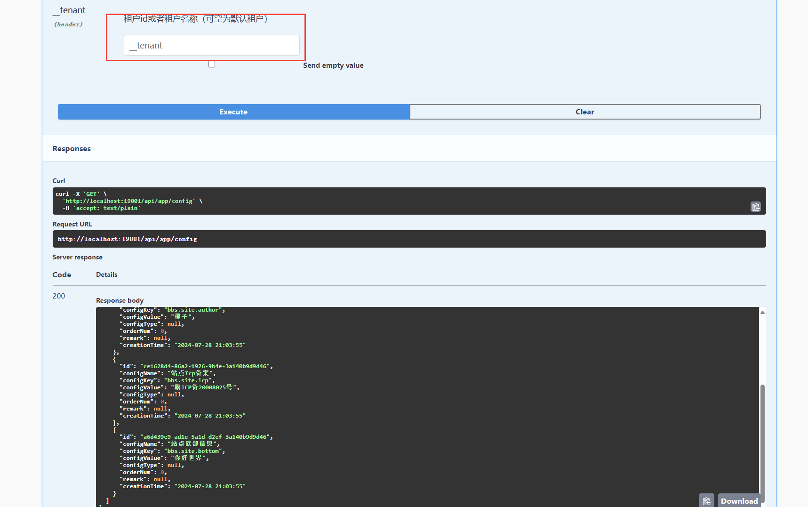
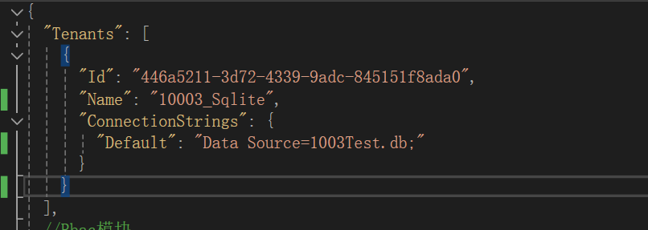

## 多租户
多租户的概念、模式特别多，想要狠狠的把玩好多租户，在使用多租户之前，务必了解清楚，什么是多租户？什么才是适合你的多租户选型？希望以下的内容能帮助你对多租户的理解更深入

## 什么是多租户？
不同人有很多说法，有的人说
- 能够连接多个数据库操作的就是多租户
- 通过表的一个字段进行数据过滤的就是多租户
- 能够将不同的数据存放在多个库的就是多租户
- 多租户需要主库、业务库、默认库等等要求

他们说的对吗？不能说错，但也不全对，正是因为多租户的模式比较多，实际用到的是哪种，要由业务来决定。

我们站在各各角度，给大家举个例子，自然就很好的分清楚，你当前的方式：

#### 业务方面：
- 如果你是开发的类似淘宝的软件，每个店铺是多租户的，但是里面的用户又是一起，而不需要每次进入一个店铺就要注册一个店铺淘宝账号（需要主库共享，业务库多租户）
- 如果是你开发一个类似餐饮的软件，每个线下餐馆都是一个新的客户，而一个用户的数据不需要共享在两个店铺中（业务库多租户）
- 如果你开发的是一个类似Mes工厂系统的软件，你的很多设备数据甲方要求从他们的数据库中直接搂，意味着你的软件需要处理自己的数据库，还要连接客户的数据库（需要根据操作的实体进行切换数据库）

#### 安全方面：
- 通过表字段进行隔离，既加一个租户id字段，查询表的时候进行数据过滤（操作简单，成本低，但是隔离程度低，一个租户出问题，其他都影响）
- 通过数据库进行隔离，既通过租户id进行切换数据库，一个租户一个数据库（操作复杂，成本高，但是隔离程度高，一个租户出问题，不会影响到其他租户）
- 通过数据库和表字段混合进行隔离，既可以选择是表隔离还是数据库隔离（结合上面的优缺点，对软件设计要求程度高）

> 如果是多数据库，还可以兼容考虑不同数据库类型，A用mysql，B用sqlserver，这种更加复杂。

#### 配置方式：
- 事先知道要连几个数据库，代码里先new几个db，根据传入的租户条件进行选择使用哪个db（需改代码，成本低，切换租户方便）
- 通过配置文件进行配置租户数量，变更租户数量代码无须更改，但是会根据传入的租户条件进行选择哪个配置的db（需重启，成本较高，切换租户较困难）
- 通过界面上进行动态管理租户，变更租户数量代码无须更改，会根据传入的租户条件进行选择哪个db（无需重启，成本高，切换租户较困难）

> 等等，什么千奇百怪的方式都有，不同的方式适合不同的需求
## YI框架支持的多租户
- [x] 表字段进行隔离
- [x] 数据库进行隔离，且支持不同租户多数据库类型
- [x] 支持配置文件租户
- [x] 支持界面配置租户（界面配置其实也是能通过接口配置，一个道理）
- [x] 支持不同实体访问不同数据库（需使用sqlsugar功能）

## 接入多租户教程

yi框架基本大部分多租户方式都支持，以下教程是基于较困难的数据库分库的多租户模式

#### 开启
默认是不开启多租户的，需要在配置文件中开启后才生效

> 多租户是有默认库的概念存在，即，当接口传入的信息中，不带有任何租户信息，你也不能报错，框架会自动选择Url为默认租户库，另外，租户表，也会存储在默认库中

启动后，我们切换swagger到租户模块（默认模板中，已接入租户模块，但配置文件是关闭的）

这里需要注意一下
> 由于sqlsugar简化了efcore,dbcontext上下文的概念，所以无法从dbcontext获取当前使用的是什么db类型，另外，又为了兼容`abp连接字符串`模块，只能通过`连接key`，和`连接url`中存放db类型，所以db类型有个规定，以租户name的尾缀 "_xxx" 来决定，如果没有，将保持和默认库的db类型一致

我们创建好一个db类型之后，通过返回的租户id，可以进行初始化（既框架实现了各各租户的db创建、表结构创建、种子初始化数据）

我们可以看到，数据已经初始化了

接下来，我们如何使用该租户呢？
我们选择rbac模块下的config表，进行操作

根据前端head传入的租户id，框架将自动切换租户，我们给他刚刚创建的租户，新增一个config

然后再查询他的config，发现确实新增了

如果我不传租户信息，使用默认库，就没有这条信息了

当然，如果你的租户不想在数据库中配置，这套模式得力于abp连接字符串模块支持，可以通过配置文件新增（优先级更高）

我们在配置文件中新增一个租户：

重复以上部分，结果是一模一样的，如果你的多租户是固定的，或者数据库很少，直接放配置文件还方便些~
